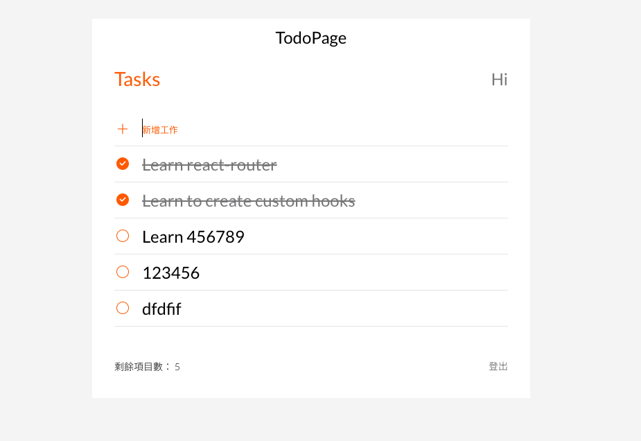

# Todo List X MVC with React


## Introduction
This project was bootstrapped with [Create React App](https://github.com/facebook/create-react-app).
Apart from the todo list page, all the other pages are static.
In the todo list page, you can :
* Enter your todo items in the input box at the top. 
* To add a new item, you can click the "Add" button or press the Enter key. 
* To edit a todo item, simply double-click on it, and press Enter to save the changes, or press Esc to discard them. 
* By clicking on the circle on the left of a todo item, you can toggle between marking it as completed or incomplete.
* You can delete a todo item by clicking the "X" button on the right.


## Getting Started

1. Please ensure that npm and Node.js have been installed in the environment.
2. Clone the project to local repository.
   ```
   $ git clone https://github.com/Yoruyeh/todolist-react.git 
   ```
3. Use terminal to open the file in local, and input below instruction:
    ```
    $ npm install
    ```
4. Input below instruction after the install:
    ```
    $ npm start
    ```
5. The webpage will be opened in 'http://localhost:3000' automatically, if you see below message in terminal:
    ```
    webpack compiled successfully
    ```
6. Manually set routes after the URL: 
    ```
    http://localhost:3000 **/todo**
    http://localhost:3000 **/login**
    http://localhost:3000 **/signup**
    ```
7. If you would like to stop using the website:
    ```
    ctrl + c
    ```

## Devloper Tools

* Node.js v14.18.1
* React 18.2.0
* react-router-dom 6.4.1
* Sass
